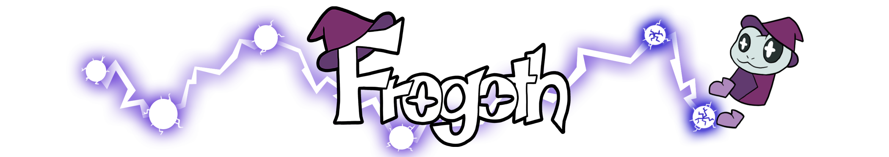

 
  **Frogoth is a 2D platformer that relies heavily on movement. As a magical frog, you explore a gloomy city full of dangers. You can't attack enemies directly, use your movement to create a shape around the enemies to defeat them.**

 Frogoth was developed as a student project at the [S4G School for Games](https://www.school4games.net) in early 2024.

 Play it on [Itch.io](https://s4g.itch.io/frogoth)!

## Tools

The game was developed using the Godot Engine and GDScript.  
We used Mercurial for version control.

## Responsibilities

As the only game engineer on the project, I was responsible for the entire programming and engine part. This included programming the entire game, implementing features and creating the UI. I also implemented a lot of the art assets and created some VFX. I also helped with the set dressing of some levels.

## Highlights
- **[Player character](/scenes/player/player.gd)** 
The player character in the game. It contains all the input functions such as walking, jumping, placing orbs, etc. It also contains some mechanics to improve the player's feeling of movement (e.g. coyote time, squash and stretch).
- **[Killing shape](scenes/kill_shape/kill_shape.gd)**  
The area the player can create to defeat the enemies.
- **[Enemy](scenes/enemies/enemy_grounded.gd)** 
  This basic enemy class is designed so that the various enemies in the game can inherit it and add their own attacks. There are currently two enemies in the game, one with a [single shot](scenes/enemies/enemy_single_shot.gd) and a second with a [scatter shot](scenes/enemies/enemy_multiple_shot.gd).

